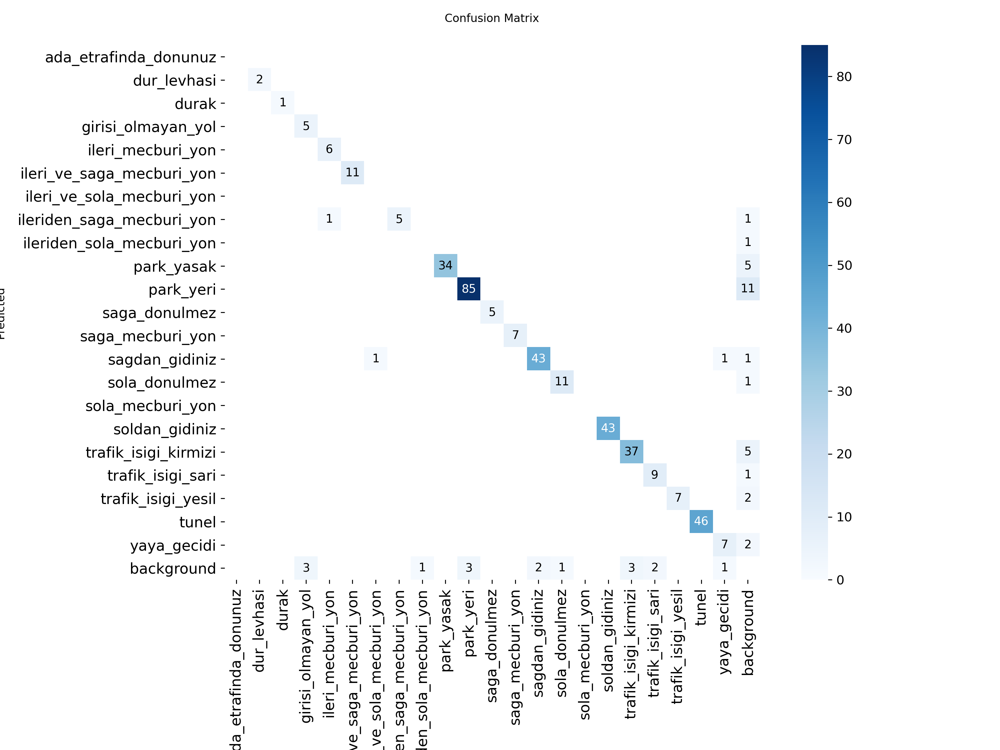

# 🚦 Otonom Sistemler İçin Gerçek Zamanlı Trafik İşareti Tanıma

## 📌 Proje Özeti
Bu proje, otonom araç navigasyon sistemlerinde (Robotaksi vb.) kullanılmak üzere geliştirilmiş, yüksek doğruluklu ve gerçek zamanlı bir trafik işareti tanıma modelidir. YOLOv11s mimarisi kullanılarak eğitilen model, değişken ışık koşullarında ve hareket halindeki araç kameralarında yüksek performans gösterecek şekilde optimize edilmiştir.

## 📊 Veri Seti ve Ön İşleme
Model, otonom sürüş senaryolarında karşılaşılabilecek çeşitli trafik işaretlerini barındıran kapsamlı bir veri seti üzerinde eğitilmiştir. 
* Kötü hava koşulları, bulanıklık ve farklı mesafeleri simüle etmek için *Mosaic*, *Scale*, *HSV* gibi gelişmiş veri artırma (data augmentation) teknikleri uygulanmıştır.

## 🧠 Model Performansı ve Metrikler
150 epokluk eğitim sürecinde elde edilen sonuçlar, modelin sahadaki güvenilirliğini kanıtlar niteliktedir. Aşırı öğrenme (overfitting) engellenmiş ve yüksek IoU eşiklerinde bile güçlü sonuçlar elde edilmiştir.

* **mAP@0.50:** %96.6
* **mAP@0.50:0.95:** %86.3
* **Precision (Kesinlik):** ~%93
* **Recall (Duyarlılık):** ~%94

### 📈 Eğitim Grafikleri

Aşağıdaki grafikler modelin öğrenme sürecini ve sınıf bazlı ayrıştırma başarısını detaylandırmaktadır:

<b>1. Confusion Matrix (Karmaşıklık Matrisi)</b>

Modelin sınıfları ayırmadaki yüksek başarısı ve düşük arka plan (background) karmaşası.

  

<b>2. F1-Confidence Eğrisi</b>

F1 skoru ile güven eşiği (confidence threshold) arasındaki optimum denge.

